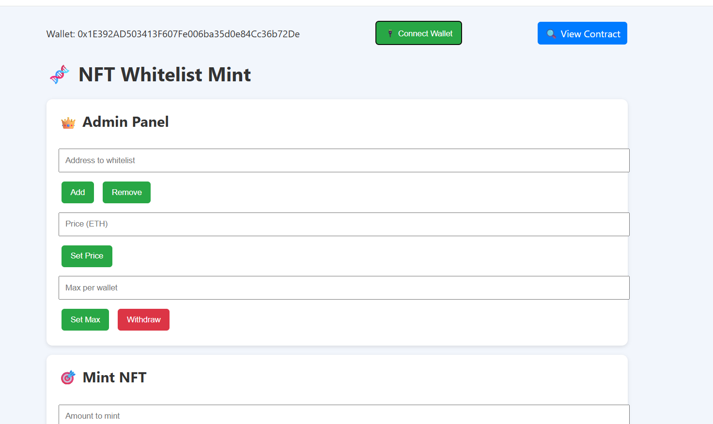
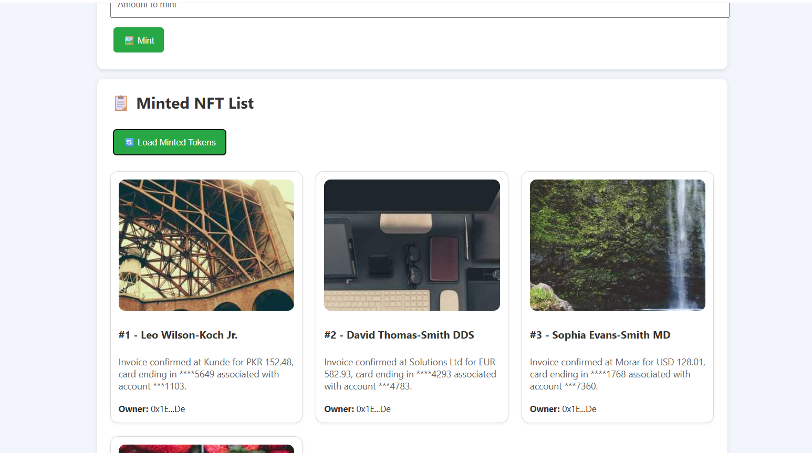

# 🎨 NFT Whitelist Sale DApp

Một DApp NFT whitelist mint đơn giản được xây dựng bằng Solidity và triển khai trên mạng Sepolia. Người dùng có thể mint NFT nếu nằm trong danh sách whitelist, với giới hạn số lượng mint mỗi ví. Admin có thể thêm/xóa whitelist, thay đổi giá mint và rút ETH từ hợp đồng.

---

## 🔗 Contract Verified on Sepolia

✅ [0x67426256B28c89349ab25e886876Fe5A24c21976](https://sepolia.etherscan.io/address/0x67426256B28c89349ab25e886876Fe5A24c21976#code)

---

## 🛠️ Công nghệ sử dụng

- Smart Contract: Solidity + OpenZeppelin (ERC721)
- Frontend: HTML, CSS, JavaScript (thuần)
- Blockchain: Ethereum Testnet Sepolia
- Metadata: MockAPI server (`baseURI` → JSON Metadata)

---

## ⚙️ Tính năng chính

### 👑 Admin (Owner)
- `addToWhitelist(address)`: Thêm người dùng vào whitelist.
- `deleteFromWhitelist(address)`: Xóa người dùng khỏi whitelist.
- `setterPrice(uint)`: Thay đổi giá mint.
- `setterMaxPerWallet(uint8)`: Cập nhật giới hạn số lượng mint mỗi ví.
- `withdraw()`: Rút toàn bộ ETH từ hợp đồng về ví owner.

### 🧑‍🎨 Người dùng (Whitelisted User)
- `mint(uint8 amount)`: Mint NFT (tối đa `MAX_PER_WALLET`, phải thanh toán `price * amount`)
- `getAllMintedTokens()`: Trả về danh sách tất cả tokenId, chủ sở hữu, và URI.

---

## 💻 How to Run the Hardhat Project

### 🔧 1. Install Dependencies

```bash
cd dApp
npm install
````

### 🔐 2. Environment Configuration

Tạo file `.env` trong thư mục `dApp/` với nội dung sau:

```env
TESTNET_PRIVATE_KEY=your_wallet_private_key
SEPOLIA_RPC_URL=https://sepolia.infura.io/v3/YOUR_INFURA_PROJECT_ID
```

> ⚠️ **Important**: Tuyệt đối **không chia sẻ private key công khai**.

### ⚙️ 3. Compile Contracts

```bash
npx hardhat compile
```

### 🚀 4. Deploy to Sepolia

```bash
npx hardhat run deploy --network sepolia
```

### ✅ 5. Verify on Etherscan

```bash
npx hardhat verify --network sepolia <your_contract_address>
```

### 🌐 6. Run the Frontend

Mở file `index.html` bằng **Live Server** (trong VS Code hoặc extension tương tự). Truy cập tại:

```
http://127.0.0.1:5500/index.html
```

---

## 🖼️ Giao diện người dùng




---

## 🧾 Metadata JSON

```json
{
  "name": "NFT",
  "description": "This is a whitelist-only NFT.",
  "image": "https://picsum.photos/id/1/300/300",
  "id" : "1",
}
```

👉 Hợp đồng sẽ tạo `tokenURI = baseURI + tokenId`. Metadata cần tuân chuẩn ERC721.

---

## 🌟 Product Demo

🌐 Website: [https://tcrow06.github.io/capstone-project/](https://tcrow06.github.io/capstone-project/)
